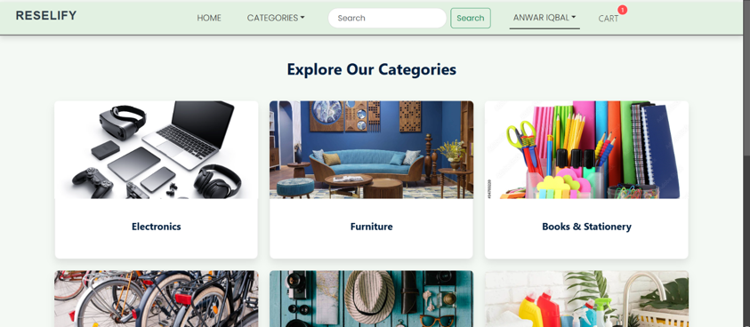
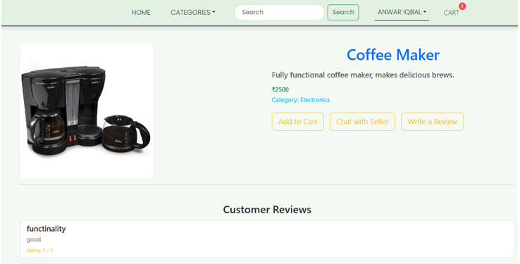
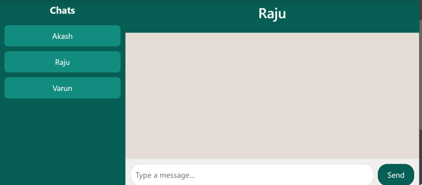
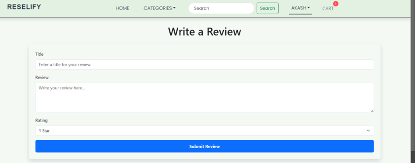

# Reselify: A Marketplace for Students  

Welcome to **Reselify**, the ultimate platform designed for students to effortlessly buy and sell items within their community. Whether you're decluttering your dorm or hunting for the best deals, Reselify is your trusted marketplace to connect with fellow students.  

---

##  Features  

-  **User Authentication**: Secure sign-up and log-in to manage your account.  
-  **Product Listings**: Easily add, edit, and browse items for sale.  
-  **Category Filters**: Find products quickly with intuitive category-based filtering.  
-  **Payment Redirection**: Seamless and secure payments through gateways like Google Pay.  
-  **Responsive Design**: Optimized for both mobile and desktop devices.  

---

##  Installation  

Follow these steps to set up Reselify locally:  

###  Prerequisites  

Ensure you have the following installed:  

- [Node.js (v20.18.0)](https://nodejs.org/)  
- [MongoDB (local)](https://www.mongodb.com/docs/manual/installation/)  

---

###  Setup Instructions  

1. Clone the repository:  
   ```bash  
   git clone https://github.com/an-iqbal/reselify.git  
   cd reselify  
   ```  

2. Install dependencies:  
   For the backend:  
   ```bash  
   npm install  
   ```  
   For the frontend:  
   ```bash  
   cd client  
   npm install  
   ```  

3. Start the application:  
   Run both the frontend and backend servers together:  
   ```bash  
   npm run dev  
   ```  

---

##  Screenshots

###  Home Page


###  Explore Categories


###  About Product


###  Sign in page


###  Chats


###  Write Review


---

##  Usage 

1. **Sign up** or **log in** to your account.  
2. List your items for sale or browse for items you want to purchase.  
3. Use filters to refine your search for specific categories.  
4. Contact sellers or make payments securely through integrated payment gateways.  

---

##  Contact Us  

Have questions or suggestions? I’d love to hear from you!  

-  Anwar Iqbal: [anwar.iqbal1390@gmail.com](mailto:anwar.iqbal1390@gmail.com)  

---

##  Contributing  

Contributions are welcome! Feel free to submit issues or open pull requests to improve the platform.  
